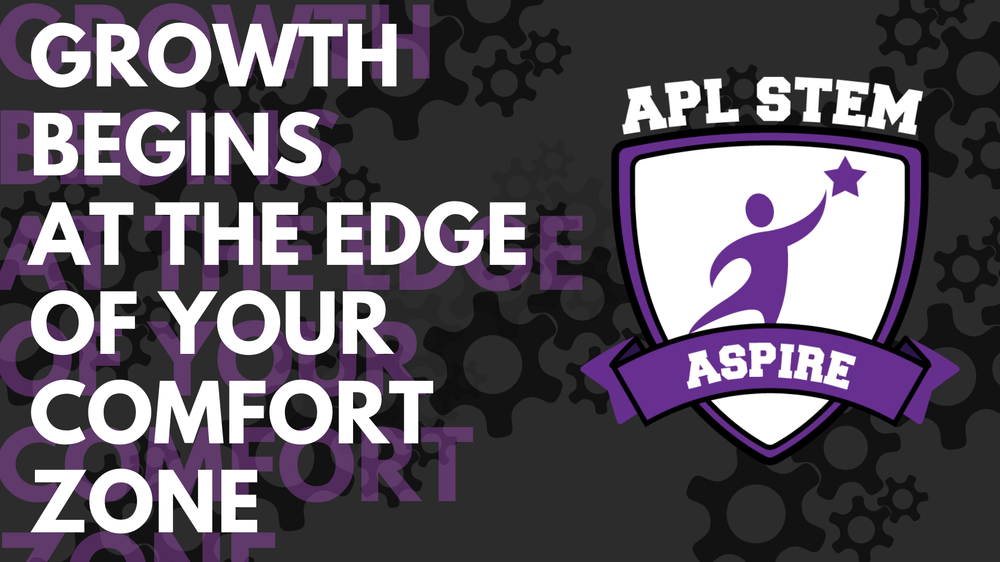

# Object Detection In Video

## A 2021 JHU/APL Summer ASPIRE Project

### Project & Team Info

#### Project

The Summer 2021 ASPIRE Intern project is a Computer Science-Artificial Intelligence (CS-AI) project that seeks to build on the project completed by the 2020-2021 ASPIRE Intern group. The previous ASPIRE intern cohort spent the year developing a custom ML model for identifying handwritten information, then building software around that work that would allow humans to use both their software and their ML model. This summer, this new cohort is looking to expand that project into more real-world computer vision scenarios.  

This project allows mentees to build software that does real-time object detection and distance-calculation using open-source machine learning toolsets. This project is designed to be a deep dive to AI/ML where the final deliverable is a program that uses ML to identify objects in real-time video feeds. The focus is to develop fundamental communication & critical thinking/problem solving skillsets that are deeply valued across any STEM-related field. This project revolves around the guided development and implementation of a custom (and existing) neural networks, offering mentees an exposure to concepts like transfer learning. Our end goal is to have a custom-built ML classifier & software program that allows users to upload or capture real-time video and properly display to the user the objects that are in that video feed.  

#### Team

This team consists of three (3) Summer 2021 APL ASPIRE Mentees, and one (1) APL ASPIRE Mentor.

**Neha Anumalasetty, ASPIRE Mentee:** Neha is a rising senior at

**Lauren Rabe, ASPIRE Mentee:** Lauren is a rising junior at

**Ian Thorpe, ASPIRE Mentee:** Ian is a rising junior at

**Matt Montoya, ASPIRE Mentor:** Matt is a graduate student at Johns Hopkins University & works as a software engineer for JHU's Applied Physics laboratory. He graduated from the University of Texas at El Paso (UTEP) in 2020 with a B.S. in Computer Science. Before working full-time, Matt interned at APL & was an undergraduate research assistant at the Stanford Intelligent Systems Laboratory (SISL) at Stanford University. During his spare time, Matt enjoys skateboarding at the beach, exploring new restaurants around Los Angeles, & hiking in the Southern California mountains.

### Setup

### Usage

### Disclosures

This project is unclassified, holds no material sensitivity, is not monetarily sponsored by or under any NDA by JHU, JHU/APL, or any of its sponsors & affiliates. Work on this project by any mentor(s) is completed on a voluntary basis and completed outside of billable time. The ASPIRE image used in this README file is an unclassified Zoom background.

All personal information regarding team members is self-published by each respective person, with the complete understanding that this information will be publicly available. Personal information was last updated July 2021.

### About JHU/APL ASPIRE

The ASPIRE program at APL is a unique opportunity for high school juniors and seniors to experience and explore STEM careers before committing to an area of study in college. During the intensive summer session and the longer academic-year session, ASPIRE interns are paired with APL staff mentors to complete projects, solve problems, and learn and apply crucial technical and interpersonal skills in a hands-on, professional environment. During their internship, students also have access to many of APL’s considerable technical and professional resources. The ASPIRE program is an unpaid learning experience and is not a job.  

For questions regarding the aspire program please [visit the ASPIRE webpage](https://secwww.jhuapl.edu/stem/aspire/) or email Aspire@jhuapl.edu.
